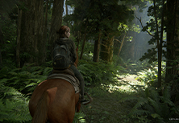

<!DOCTYPE html>
<html><head>
    <link href="https://fonts.googleapis.com/css?family=IM+FELL+DW+Pica+SC&display=swap" rel="stylesheet" />
    <link href="./Css/main.css" rel="stylesheet" />
    <title>The Last of Us</title>
    </head>
    <body>
    

        

            
            <a href="https://cyber.sports.ru/tribuna/blogs/pogorskythinks/2796129.html" target="_blanck">Script</a>
            <a href="#ch">Character</a>
            First part
            

        

    

        

            

                

                
                

                

                    
Last of Us  Part II

                    <section class="under">
                        adventure thriller with  elements of survival horror and third-person stealth action
                        
<button class="bt"><a href="https://store.playstation.com/ru-ru/product/EP9000-CUSA10249_00-THELASTOFUSPART2" target="_blank">buy game</a></button>

                    </section>
                

            

        
 
        

            

                
graphics
   
                
gameplay

                
atmosphere

                
monsters

            

        

    

            Characters
            

                

                    

                    Ellie
                    A brave, 19-year-old girl, Ellie has grown up in this harsh world and it is all she has ever known. She’s an orphan who was raised in a boarding school run by the military within the bounds of  the quarantine zone.     
                

                

                    

                    Ebby
                    Nothing is known about Abby's early life, except that she lived in Salt Lake City with her father in the context of the cordyceps cerebral infection pandemic. Together they joined the     Cicadas.    
                

                

                    

                    Dina
                    At some point prior to 2033, Dina moved to Jackson under the leadership of Tommy and Maria. During their trip to Seattle, Dina told Ellie her first kill was when she was ten, stabbing a man who tried to attack her mother. She also became acquainted with Jesse, another survivor who lived within the settlement.
                

            

        
       
            

            

            Sole proprietor " kekl”
            

            

        

    </body>
</html>
<!--        

                    
                

                

                    
                
 
--!>
